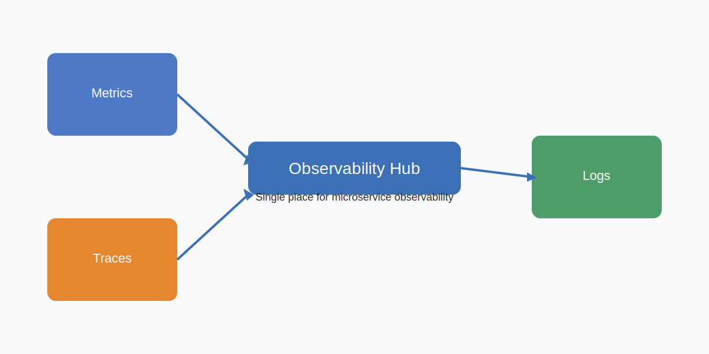
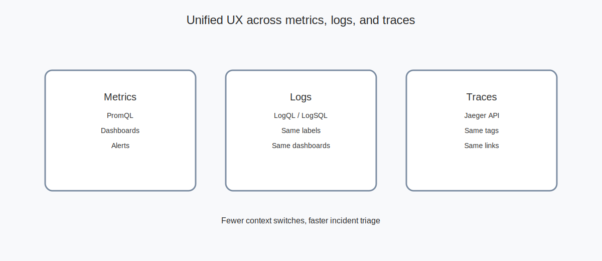
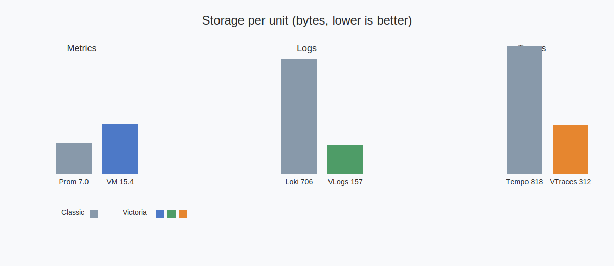
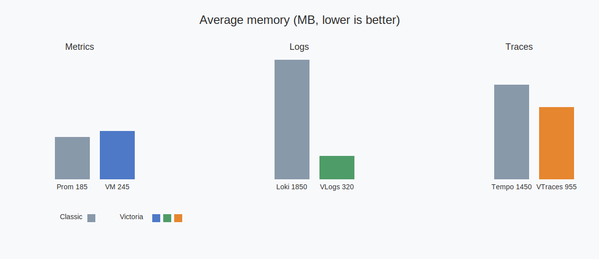
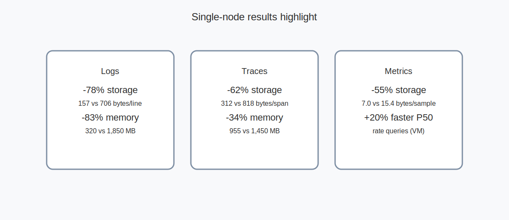

# New Monitoring Stack Overview

Goal
- Single place for metrics, logs, and traces with transparent observability
- Optimized for micro-service-based systems: consistent labels, queries, and dashboards
- No suitable on-premises single-vendor solution that meets resource and UX requirements

Classic stack (`Grafana Labs`)
- `Prometheus` (metrics), `Loki` (logs), `Tempo` (traces), `Grafana` (dashboards)

Chosen stack (Victoria products)
- `VictoriaMetrics`, `VictoriaLogs`, `VictoriaTraces`, `Grafana`
- Selected based on single-node performance tests to reduce storage and memory

Why it matters
- Fewer context switches during incidents and faster triage
- Predictable storage growth and lower resource footprint
- Transparent UX: same labels and cross-links across metrics, logs, traces

Conclusion from single-node tests
- Logs: **157 vs 706 bytes/line** (VictoriaLogs ~78% less), **320 vs 1,850 MB** average memory
- Traces: **312 vs 818 bytes/span** (VictoriaTraces ~62% less), **955 vs 1,450 MB** average memory
- Metrics: **7.0 vs 15.4 bytes/sample** and **185 vs 245 MB** average memory
- Metrics latency: **~20% faster P50** rate queries (VictoriaMetrics)
- Net: resource efficiency improves while keeping comparable query UX

