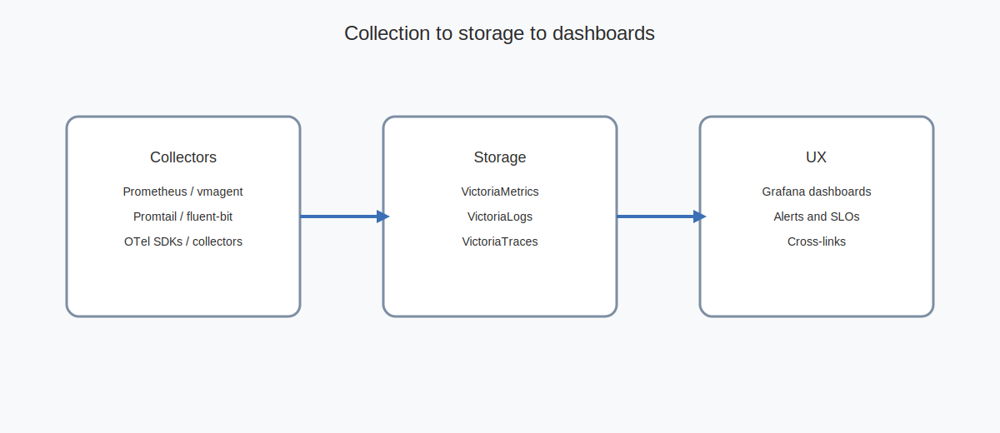
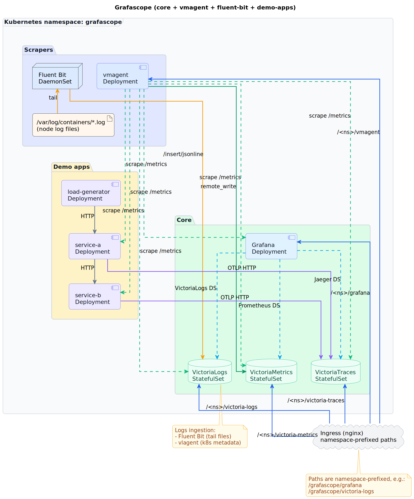

# Components and Architecture

Core services
- `Grafana` for dashboards and alerts
- `VictoriaMetrics` for metrics storage and PromQL queries
- `VictoriaLogs` for log storage and LogSQL queries
- `VictoriaTraces` for trace storage and Jaeger API queries

Collectors and scrapers
- `Prometheus` and `vmagent` for metrics scraping and remote_write
- `Promtail`, `fluent-bit`, or `vlogs_forwarder` for log streaming from stdout
- `OpenTelemetry` SDKs and collectors for trace ingestion (OTLP)

Data flow
- `metrics_load` -> `Prometheus` + `vmagent` -> `VictoriaMetrics`
- `logs_load` stdout -> `Promtail` -> `Loki` (classic) and `vlogs_forwarder` -> `VictoriaLogs`
- `traces_load` OTLP -> `Tempo` (classic) and `VictoriaTraces`

Architecture diagram
- `grafascope-architecture.svg` (repo root)
- Rendered here: 
