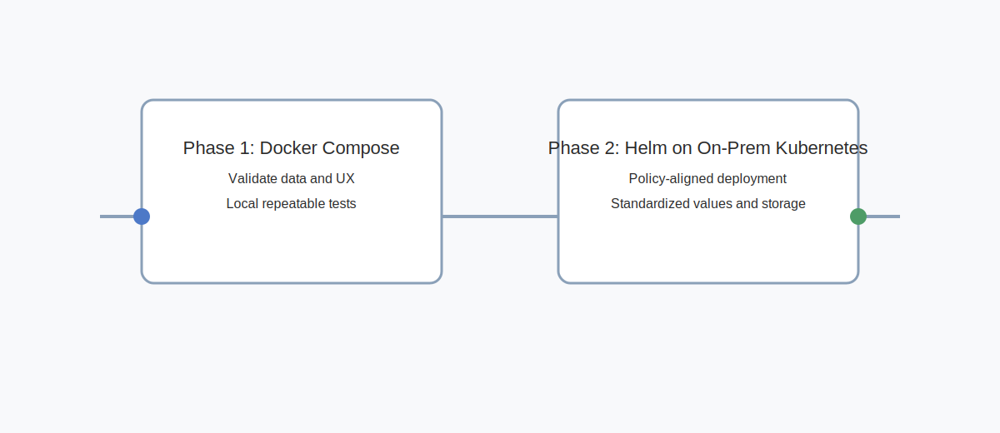

# Rollout

Approach
- Single instance core set on demand
- Start with simplest path to validate data quality and UX
- Validate data = completeness, parity with classic stack, and zero drop rate

Phase 1: Docker Compose
- `Grafana`, `VictoriaMetrics`, `VictoriaLogs`, `VictoriaTraces`
- Scrapers and forwarders for metrics/logs/traces
- Local repeatable perf tests and dashboards

Phase 2: Helm on on-premises Kubernetes
- Single-line deployment using Helm charts
- Aligned with cluster policies and namespaces
- Standardized values, ingress, and storage classes

Operational gates
- Data completeness >= 99.9%
- P50 latency within +10% of baseline or better
- Storage and memory improvements vs current
